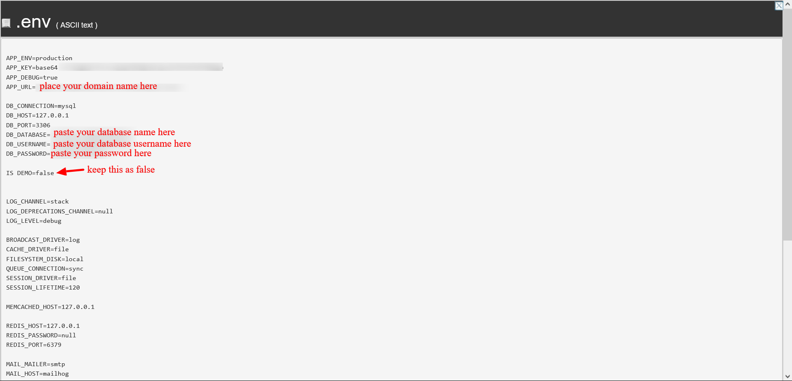

# Import and deploy

In this part, we will cover how to import the project and make website live

### Import file 

1. First open `File manager` from cPanel.
2. Now select `public_html` folder and select `Upload` button.
3. Now upload the `HRSYSTEM-ADMIN.zip` file. Points shown in image down below.
   * Now right click on `HRSYSTEM-ADMIN.zip` file and click `Extract` option.
   * Double click `HRSYSTEM-ADMIN` folder and select `Select All` button.
   * Now click `Move` button
   * In path, remove current folder name: `HRSYSTEM-ADMIN.`
   * Click `Move Files`.
4. After import is successful, right click `.env` file and select edit button. If you get a popup, you will see edit button again. Click edit button and you will be redirected to edit view.
5. Now do the changes as shown in image

<figure><figcaption></figcaption></figure>

1. Select Save Changes button.

### Laravel setup 

1. Now search `terminal` in cPanel.
2. Now type as follows:
   1. `cd public_html`
   2. `composer install`
   3. `php artisan migrate`
   4. `php artisan passport:install`
   5. `php artisan key:generate`
   6. `php artisan storage:link`
   7. `php artisan db:seed`
   8. `composer dump-autoload`

This is all you need to make DigitalHR fully working. Now you can access `HRSYSTEM` using `your-domain-name.com`.

