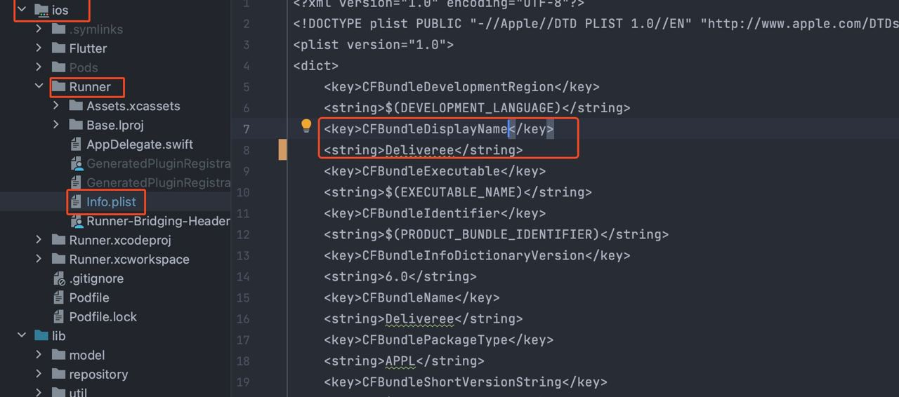

# Change Application Name


### Android <a href="#android" id="android"></a>

Open the file AndroidManifest.xml under android--> app --> src --> main. Enter the preferred app name in the label under application tag.

```
<application
        android:label="Enter Your Desired Name Here" 
        android:name="${applicationName}"
        android:requestLegacyExternalStorage="true"
        android:icon="@mipmap/launcher_icon">
```

### iOS <a href="#ios" id="ios"></a>

For iOS, change the name for `CFBundleDisplayName` as shown in image below.

<figure><figcaption></figcaption></figure>
